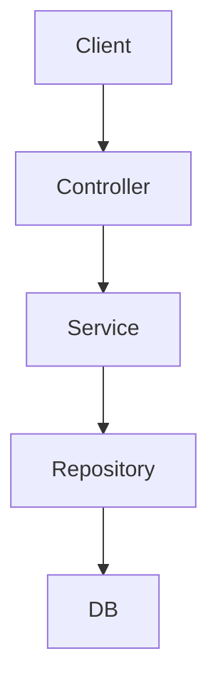

### Kiến trúc tổng quan NestJS


## Module là gì?
> - **Module** là một khối logic cơ bản trong NestJS, được sử dụng để tổ chức ứng dụng theo **tính năng** hoặc lĩnh vực nghiệp vụ.
>
> - Mỗi ứng dụng NestJS luôn có ít nhất một module, đó là `AppModule`

## Định nghĩa một Module
> Module được định nghĩa bằng cách sử dụng decorator `@Module()` từ NestJS. Một module là một class có decorator này: 
#### Các thuộc tính chính của `@Module()`:
> - `imports`: nhập các module khác mà module này phụ thuộc.
> - `controllers`: chứa các controller xử lý các yêu cầu HTTP.
> - `providers`: các service, factory, hoặc class được sử dụng trong module.
> - `exports`: những provider được chia sẻ để sử dụng ở module khác.
## Tổ chức Module
> - NestJS khuyến khích kiến trúc modular, mỗi module đảm nhận một chức năng nhất định, ví dụ: `UsersModule`, `AuthModule`, `ProductsModule`,...
## Import các Module khác
> - Module có thể **import** các module khác để sử dụng provider của chúng.
```ts showLineNumbers
@Module({
    imports: [CatsModule],
})
export class AppModule{}
```
## Chia sẻ Providers giữa các Module
- Để một provider dùng được ở module khác, cần:
> - **Export** provider đó trong module nơi nó được định nghĩa.
> - **Import** module đó trong module muốn sử dụng provider.
```ts showLineNumbers
// cats.module.ts
@Module({
  providers: [CatsService],
  exports: [CatsService],
})
export class CatsModule {}

// app.module.ts
@Module({
  imports: [CatsModule],
})
export class AppModule {}
```
## Global Modules (Module toàn cục)
- Một module có thể đánh dấu là **global** để không cần import lại ở các module khác.
```ts showLineNumbers
import { Global, Module } from '@nestjs/common';

@Global()
@Module({
  providers: [CommonService],
  exports: [CommonService],
})
export class CommonModule {}
```
> Chú ý: Chỉ nên dùng module global một cách cẩn trọng để tránh xung đột hoặc khó quản lý dependency.
## Forward References (Tham chiếu chéo)
- Khi hai module phụ thuộc lẫn nhau (circular dependency), dùng `forwardRef()`:
```ts showLineNumbers
@Module({
  imports: [forwardRef(() => CatsModule)],
})
export class DogsModule {}
```
## Dynamic Modules (Module động)
- Dùng để tạo module có thể cấu hình động theo nhu cầu (ví dụ: truyền options, config,...).
```ts showLineNumbers
@Module({})
export class DynamicModule {
  static register(options: SomeOptions): DynamicModule {
    return {
      module: DynamicModule,
      providers: [{ provide: 'OPTIONS', useValue: options }],
    };
  }
}
```
## Lifecycle Hook trong Module
- Có thể triển khai interface `OnModuleInit` và `OnModuleDestroy` để xử lý logic khi module được khởi tạo hoặc bị hủy.
```ts showLineNumbers
@Injectable()
export class SomeService implements OnModuleInit {
  onModuleInit() {
    console.log('Module initialized');
  }
}
```
## Tổ chức cấu trúc dự án lớn
- NestJS khuyến nghị chia theo **feature module** thay vì chia theo layer (controller/service/model), giúp dễ mở rộng, bảo trì.