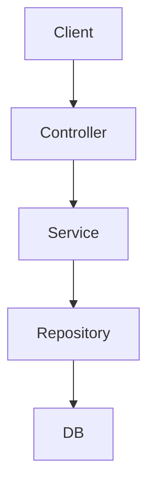

### Kiến trúc tổng quan NestJS


## Module là gì?
> - **Module** là một khối logic cơ bản trong NestJS, được sử dụng để tổ chức ứng dụng theo **tính năng** hoặc lĩnh vực nghiệp vụ.
>
> - Mỗi ứng dụng NestJS luôn có ít nhất một module, đó là `AppModule`

## Định nghĩa một Module
> Module được định nghĩa bằng cách sử dụng decorator `@Module()` từ NestJS. Một module là một class có decorator này:
#### Các thuộc tính chính của `@Module()`:
> - `imports`: nhập các module khác mà module này phụ thuộc.
> - `controllers`: chứa các controller xử lý các yêu cầu HTTP.
> - `providers`: các service, factory, hoặc class được sử dụng trong module.
> - `exports`: những provider được chia sẻ để sử dụng ở module khác.

> Dấu `@` trong NestJS là một **Decorators** là một tính năng giúp chú thích và cấu hình các thành phần trong ứng dụng một cách rõ ràng và dễ đọc
:::tip Một số Decorators phổ biến trong NestJS
| Decorator                                             | Mục đích                                                                                 |
| ----------------------------------------------------- | ---------------------------------------------------------------------------------------- |
| `@Module()`                                           | Đánh dấu một class là module – chứa các controller, provider, import/export module khác. |
| `@Controller()`                                       | Đánh dấu một class là controller – xử lý các request từ client.                          |
| `@Get()`, `@Post()`, `@Put()`, `@Delete()`            | Mapping các method HTTP đến các hàm xử lý tương ứng trong controller.                    |
| `@Injectable()`                                       | Đánh dấu class là provider có thể được inject (thường là service).                       |
| `@Inject()`                                           | Dùng để inject thủ công một provider nào đó.                                             |
| `@Body()`, `@Param()`, `@Query()`, `@Req()`, `@Res()` | Decorators để truy xuất dữ liệu từ request (thân request, params, query, v.v).           |
:::

## Tổ chức Module
> - NestJS khuyến khích kiến trúc modular, mỗi module đảm nhận một chức năng nhất định, ví dụ: `UsersModule`, `AuthModule`, `ProductsModule`,...
## Import các Module khác
> - Module có thể **import** các module khác để sử dụng provider của chúng.
```ts showLineNumbers
@Module({
    imports: [CatsModule],
})
export class AppModule{}
```
## Chia sẻ Providers giữa các Module
- Để một provider dùng được ở module khác, cần:
> - **Export** provider đó trong module nơi nó được định nghĩa.
> - **Import** module đó trong module muốn sử dụng provider.
```ts showLineNumbers
// cats.module.ts
@Module({
  providers: [CatsService],
  exports: [CatsService],
})
export class CatsModule {}

// app.module.ts
@Module({
  imports: [CatsModule],
})
export class AppModule {}
```
## Global Modules (Module toàn cục)
- Một module có thể đánh dấu là **global** để không cần import lại ở các module khác.
```ts showLineNumbers
import { Global, Module } from '@nestjs/common';

@Global()
@Module({
  providers: [CommonService],
  exports: [CommonService],
})
export class CommonModule {}
```
> Chú ý: Chỉ nên dùng module global một cách cẩn trọng để tránh xung đột hoặc khó quản lý dependency.
## Forward References (Tham chiếu chéo)
- Khi hai module phụ thuộc lẫn nhau (circular dependency), dùng `forwardRef()`:
```ts showLineNumbers
@Module({
  imports: [forwardRef(() => CatsModule)],
})
export class DogsModule {}
```
## Dynamic Modules (Module động)
- Dùng để tạo module có thể cấu hình động theo nhu cầu (ví dụ: truyền options, config,...).
```ts showLineNumbers
@Module({})
export class DynamicModule {
  static register(options: SomeOptions): DynamicModule {
    return {
      module: DynamicModule,
      providers: [{ provide: 'OPTIONS', useValue: options }],
    };
  }
}
```
## Lifecycle Hook trong Module
- Có thể triển khai interface `OnModuleInit` và `OnModuleDestroy` để xử lý logic khi module được khởi tạo hoặc bị hủy.
```ts showLineNumbers
@Injectable()
export class SomeService implements OnModuleInit {
  onModuleInit() {
    console.log('Module initialized');
  }
}
```
## Tổ chức cấu trúc dự án lớn
- NestJS khuyến nghị chia theo **feature module** thay vì chia theo layer (controller/service/model), giúp dễ mở rộng, bảo trì.

## Routing 
- Trong NestJS, một route được định nghĩa thông qua **decorator** như `@Get`, `@Post`,...
```tsx showLineNumbers
    // users.controller.ts
import { Controller, Get, Post } from '@nestjs/common';

@Controller('users')
export class UsersController {
  @Get()
  getAllUsers() {
    return 'Danh sách tất cả người dùng';
  }

  @Post()
  createUser() {
    return 'Tạo người dùng mới';
  }
}
```
##  Dependency Injection
-  NestJS sử dụng DI để quản lý Service.tạo một service và inject nó vào controller.
```tsx showLineNumbers
// users.service.ts
import { Injectable } from '@nestjs/common';

@Injectable()
export class UsersService {
  getUsers() {
    return ['User1', 'User2'];
  }
}
```
```tsx showLineNumbers
// users.controller.ts
import { Controller, Get } from '@nestjs/common';
import { UsersService } from './users.service';

@Controller('users')
export class UsersController {
  constructor(private readonly usersService: UsersService) {}

  @Get()
  getAllUsers() {
    return this.usersService.getUsers();
  }
}
```
## DTO + Validation
- DTO (Data Transfer Object) giúp định nghĩa cấu trúc dữ liệu truyền vào, kèm validation sử dụng `class-validator`

```tsx showLineNumbers
// create-user.dto.ts
import { IsString, IsEmail, Length } from 'class-validator';

export class CreateUserDto {
  @IsString()
  @Length(3, 20)
  username: string;

  @IsEmail()
  email: string;
}
```
## DTO và Validation trong Route
```tsx
// users.controller.ts
import { Controller, Post, Body } from '@nestjs/common';
import { CreateUserDto } from './dto/create-user.dto';

@Controller('users')
export class UsersController {
  @Post()
  createUser(@Body() createUserDto: CreateUserDto) {
    return {
      message: 'Tạo thành công',
      data: createUserDto,
    };
  }
}
```
#### Dùng UUID (chuỗi ký tự) làm ID
> Phổ biến khi dùng với CSDL như PostgreSQL, MongoDB, Prisma, TypeORM,…
```ts
GET /users/df2f0b6e-41a1-4876-bf4e-fd4ae9e23e11
```
> Đây là ID dạng chuỗi, không phải số → không thể dùng `ParseIntPipe`.

#### Dùng MongoDB → `id` thường là `_id` dạng ObjectId
> Dạng chuỗi 24 ký tự hexa:
```ts
GET /users/64db53d6f304fcf3bcd3e61e
```
> Vẫn là string → bạn phải dùng `id: string`, KHÔNG ép `ParseIntPipe`

:::tip
## Khi nào nên dùng ID dạng chuỗi (UUID, ObjectId)

Trong các hệ thống hiện đại, việc dùng `string` làm `ID` thay cho `number` là rất phổ biến, đặc biệt với UUID hoặc MongoDB ObjectId.

| Trường hợp                      | Nên dùng                       |
| ------------------------------- | ------------------------------ |
| Dùng MongoDB                    | ObjectId là chuỗi              |
| Dùng PostgreSQL với UUID        | ID là chuỗi                    |
| Hệ thống phân tán, tăng bảo mật | UUID tránh lộ số lượng bản ghi |
| Muốn client tự sinh ID          | ID dạng string dễ generate     |
:::

> DTO dùng để định nghĩa cấu trúc dữ liệu:

- Nhận vào (từ client, ví dụ qua @Body() trong POST)
- (Tuỳ chọn) Trả ra từ API
> Nó giống như một "bộ lọc dữ liệu chuẩn" giữa client và server, đảm bảo:
- Đúng kiểu dữ liệu
- Không có dữ liệu thừa
- Có thể kiểm tra (validate) tự động
> Nếu không có file DTO NestJS vẫn sẽ chạy được nhưng sẽ có nhiều rủi ro
:::danger Không dùng DTO – Hậu quả
| **Vấn đề**                  | **Hậu quả**                                                         |
| --------------------------- | ------------------------------------------------------------------- |
| Không có kiểu rõ ràng       | Dễ sai dữ liệu (ví dụ: `name: 123`, `email: null`)                  |
| Không kiểm tra input        | Hacker dễ gửi thêm các field không mong muốn (Injection, XSS, v.v.) |
| Không gọn gàng, khó bảo trì | Logic validation trộn lẫn, dễ lỗi, code lặp lại                     |
:::
- Để validation hoạt động, cần enable `ValidationPipe` trong `main.ts`

:::tip
| Tính năng                       | Mô tả                                               |
| ------------------------------- | --------------------------------------------------- |
| Tự động validate dữ liệu        | Dựa vào class-validator decorators trong DTO        |
| Tự động trả lỗi HTTP 400        | Nếu dữ liệu không hợp lệ (`BadRequestException`)    |
| Tự động chuyển đổi kiểu dữ liệu | Ví dụ: `"123"` → `123` nếu dùng `transform: true`   |
| Bảo vệ controller               | Đảm bảo không có dữ liệu rác vào controller/service |
:::

- Không muốn tự chuyển đổi "123" => 123 thì

:::info Transform trong ValidationPipe
| **Mục tiêu**                 | **Cách làm**                                               |
| ---------------------------- | ---------------------------------------------------------- |
| Toàn bộ project tự transform | `ValidationPipe({ transform: true })` toàn cục             |
| Tắt transform ở 1 route      | `@UsePipes(new ValidationPipe({ transform: false }))`      |
| Chỉ transform vài field      | Dùng `@Type(() => Type)` trong DTO với `class-transformer` |
| Tự kiểm soát toàn bộ         | Tắt `transform` toàn cục và xử lý thủ công                 |
:::

```tsx
// main.ts
import { ValidationPipe } from '@nestjs/common';
import { NestFactory } from '@nestjs/core';
import { AppModule } from './app.module';

async function bootstrap() {
  const app = await NestFactory.create(AppModule);
  app.useGlobalPipes(new ValidationPipe());
  await app.listen(3000);
}
bootstrap();
```
## Routing nâng cao
- Có thể sử dụng các route `@Param` , `@Query` , nested route
#### Route với param:
```tsx
@Get(':id')
getUser(@Param('id') id: string) {
  return `Thông tin người dùng có id: ${id}`;
}
```
#### Route với query:
```tsx
@Get()
getUsers(@Query('page') page: number) {
  return `Trang ${page}`;
}
```
### Swagger info

> Nếu có:
- 0.0.0.0 có nghĩa là lắng nghe trên tất cả các địa chỉ IP khả dụng của máy chủ bao gồm: localhost, mạng Lan,..
- tức là mọi thiết bị có thể kết nối được đến server này, miễn sao đúng cổng và IP.
  
> Nếu Không có:
- Chỉ các ứng dụng/chương trình trên cùng máy mới kết nối được.
- Các thiết bị bên ngoài, như trình duyệt trên điện thoại hay máy khác, sẽ không kết nối được, ngay cả khi biết địa chỉ IP.

> Tóm lại:
- Dùng '0.0.0.0' khi cần truy cập từ bên ngoài, như test trên điện thoại, deploy trên server thật, hoặc chia sẻ với đồng nghiệp trong cùng mạng.
- Không dùng '0.0.0.0' khi phát triển cục bộ để tăng tính bảo mật.

