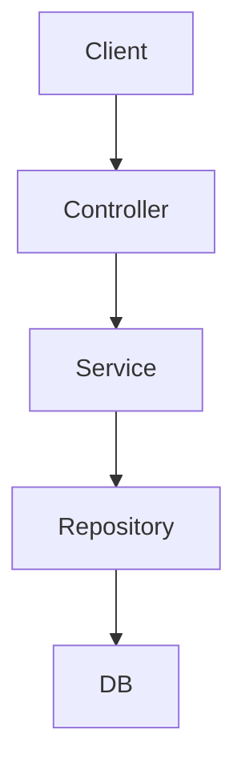

### Kiến trúc tổng quan NestJS


## Module là gì?
> - **Module** là một khối logic cơ bản trong NestJS, được sử dụng để tổ chức ứng dụng theo **tính năng** hoặc lĩnh vực nghiệp vụ.
>
> - Mỗi ứng dụng NestJS luôn có ít nhất một module, đó là `AppModule`

## Định nghĩa một Module
> Module được định nghĩa bằng cách sử dụng decorator `@Module()` từ NestJS. Một module là một class có decorator này: 
### Các thuộc tính chính của `@Module()`:
> - `imports`: nhập các module khác mà module này phụ thuộc.
> - `controllers`: chứa các controller xử lý các yêu cầu HTTP.
> - `providers`: các service, factory, hoặc class được sử dụng trong module.
> - `exports`: những provider được chia sẻ để sử dụng ở module khác.
## Tổ chức Module
> - NestJS khuyến khích kiến trúc modular, mỗi module đảm nhận một chức năng nhất định, ví dụ: `UsersModule`, `AuthModule`, `ProductsModule`,...
## Import các Module khác
> - Module có thể **import** các module khác để sử dụng provider của chúng.
```ts showLineNumbers
@Module({
    imports: [CatsModule],
})
export class AppModule{}
```