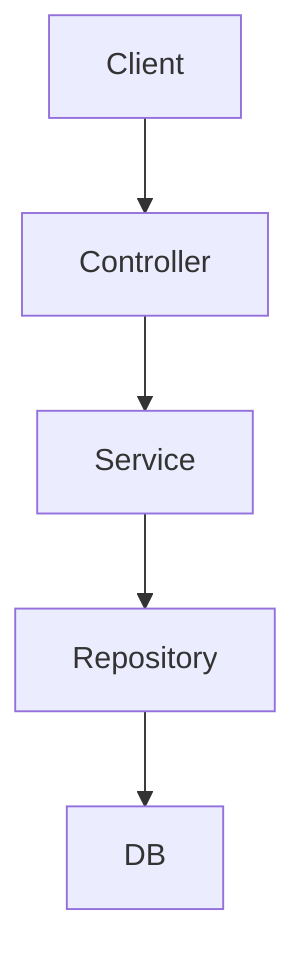

### Kiến trúc tổng quan NestJS


## Module là gì?
> - **Module** là một khối logic cơ bản trong NestJS, được sử dụng để tổ chức ứng dụng theo **tính năng** hoặc lĩnh vực nghiệp vụ.
>
> - Mỗi ứng dụng NestJS luôn có ít nhất một module, đó là `AppModule`

## Định nghĩa một Module
> Module được định nghĩa bằng cách sử dụng decorator `@Module()` từ NestJS. Một module là một class có decorator này:
#### Các thuộc tính chính của `@Module()`:
> - `imports`: nhập các module khác mà module này phụ thuộc.
> - `controllers`: chứa các controller xử lý các yêu cầu HTTP.
> - `providers`: các service, factory, hoặc class được sử dụng trong module.
> - `exports`: những provider được chia sẻ để sử dụng ở module khác.

> Dấu `@` trong NestJS là một **Decorators** là một tính năng giúp chú thích và cấu hình các thành phần trong ứng dụng một cách rõ ràng và dễ đọc
:::tip Một số Decorators phổ biến trong NestJS
| Decorator                                             | Mục đích                                                                                 |
| ----------------------------------------------------- | ---------------------------------------------------------------------------------------- |
| `@Module()`                                           | Đánh dấu một class là module – chứa các controller, provider, import/export module khác. |
| `@Controller()`                                       | Đánh dấu một class là controller – xử lý các request từ client.                          |
| `@Get()`, `@Post()`, `@Put()`, `@Delete()`            | Mapping các method HTTP đến các hàm xử lý tương ứng trong controller.                    |
| `@Injectable()`                                       | Đánh dấu class là provider có thể được inject (thường là service).                       |
| `@Inject()`                                           | Dùng để inject thủ công một provider nào đó.                                             |
| `@Body()`, `@Param()`, `@Query()`, `@Req()`, `@Res()` | Decorators để truy xuất dữ liệu từ request (thân request, params, query, v.v).           |
:::

## Tổ chức Module
> - NestJS khuyến khích kiến trúc modular, mỗi module đảm nhận một chức năng nhất định, ví dụ: `UsersModule`, `AuthModule`, `ProductsModule`,...
## Import các Module khác
> - Module có thể **import** các module khác để sử dụng provider của chúng.
```ts showLineNumbers
@Module({
    imports: [CatsModule],
})
export class AppModule{}
```
## Chia sẻ Providers giữa các Module
- Để một provider dùng được ở module khác, cần:
> - **Export** provider đó trong module nơi nó được định nghĩa.
> - **Import** module đó trong module muốn sử dụng provider.
```ts showLineNumbers
// cats.module.ts
@Module({
  providers: [CatsService],
  exports: [CatsService],
})
export class CatsModule {}

// app.module.ts
@Module({
  imports: [CatsModule],
})
export class AppModule {}
```
## Global Modules (Module toàn cục)
- Một module có thể đánh dấu là **global** để không cần import lại ở các module khác.
```ts showLineNumbers
import { Global, Module } from '@nestjs/common';

@Global()
@Module({
  providers: [CommonService],
  exports: [CommonService],
})
export class CommonModule {}
```
> Chú ý: Chỉ nên dùng module global một cách cẩn trọng để tránh xung đột hoặc khó quản lý dependency.
## Forward References (Tham chiếu chéo)
- Khi hai module phụ thuộc lẫn nhau (circular dependency), dùng `forwardRef()`:
```ts showLineNumbers
@Module({
  imports: [forwardRef(() => CatsModule)],
})
export class DogsModule {}
```
## Dynamic Modules (Module động)
- Dùng để tạo module có thể cấu hình động theo nhu cầu (ví dụ: truyền options, config,...).
```ts showLineNumbers
@Module({})
export class DynamicModule {
  static register(options: SomeOptions): DynamicModule {
    return {
      module: DynamicModule,
      providers: [{ provide: 'OPTIONS', useValue: options }],
    };
  }
}
```
## Lifecycle Hook trong Module
- Có thể triển khai interface `OnModuleInit` và `OnModuleDestroy` để xử lý logic khi module được khởi tạo hoặc bị hủy.
```ts showLineNumbers
@Injectable()
export class SomeService implements OnModuleInit {
  onModuleInit() {
    console.log('Module initialized');
  }
}
```
## Tổ chức cấu trúc dự án lớn
- NestJS khuyến nghị chia theo **feature module** thay vì chia theo layer (controller/service/model), giúp dễ mở rộng, bảo trì.

## Routing 
- Trong NestJS, một route được định nghĩa thông qua **decorator** như `@Get`, `@Post`,...
```tsx showLineNumbers
    // users.controller.ts
import { Controller, Get, Post } from '@nestjs/common';

@Controller('users')
export class UsersController {
  @Get()
  getAllUsers() {
    return 'Danh sách tất cả người dùng';
  }

  @Post()
  createUser() {
    return 'Tạo người dùng mới';
  }
}
```
##  Dependency Injection
-  NestJS sử dụng DI để quản lý Service.tạo một service và inject nó vào controller.
```tsx showLineNumbers
// users.service.ts
import { Injectable } from '@nestjs/common';

@Injectable()
export class UsersService {
  getUsers() {
    return ['User1', 'User2'];
  }
}
```
```tsx showLineNumbers
// users.controller.ts
import { Controller, Get } from '@nestjs/common';
import { UsersService } from './users.service';

@Controller('users')
export class UsersController {
  constructor(private readonly usersService: UsersService) {}

  @Get()
  getAllUsers() {
    return this.usersService.getUsers();
  }
}
```
## DTO + Validation
- DTO (Data Transfer Object) giúp định nghĩa cấu trúc dữ liệu truyền vào, kèm validation sử dụng `class-validator`

```tsx showLineNumbers
// create-user.dto.ts
import { IsString, IsEmail, Length } from 'class-validator';

export class CreateUserDto {
  @IsString()
  @Length(3, 20)
  username: string;

  @IsEmail()
  email: string;
}
```
## DTO và Validation trong Route
```tsx
// users.controller.ts
import { Controller, Post, Body } from '@nestjs/common';
import { CreateUserDto } from './dto/create-user.dto';

@Controller('users')
export class UsersController {
  @Post()
  createUser(@Body() createUserDto: CreateUserDto) {
    return {
      message: 'Tạo thành công',
      data: createUserDto,
    };
  }
}
```
- Để validation hoạt động, cần enable `ValidationPipe` trong `main.ts`

```tsx
// main.ts
import { ValidationPipe } from '@nestjs/common';
import { NestFactory } from '@nestjs/core';
import { AppModule } from './app.module';

async function bootstrap() {
  const app = await NestFactory.create(AppModule);
  app.useGlobalPipes(new ValidationPipe());
  await app.listen(3000);
}
bootstrap();
```
## Routing nâng cao
- Có thể sử dụng các route `@Param` , `@Query` , nested route
#### Route với param:
```tsx
@Get(':id')
getUser(@Param('id') id: string) {
  return `Thông tin người dùng có id: ${id}`;
}
```
#### Route với query:
```tsx
@Get()
getUsers(@Query('page') page: number) {
  return `Trang ${page}`;
}
```

