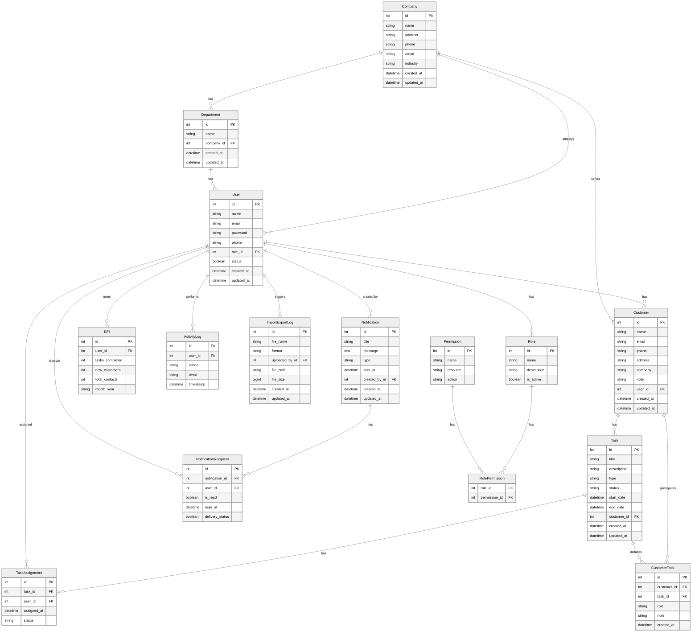

```mermaid
---
config:
  theme: neutral
---
erDiagram
    User ||--o{ Customer : "has"
    User ||--o{ Role : "has"
    User ||--o{ KPI : "owns"
    User ||--o{ ActivityLog : "performs"
    User ||--o{ ImportExportLog : "triggers"
    Customer ||--o{ Task : "has"
    Task ||--o{ TaskAssignment : "has"
    User ||--o{ TaskAssignment : "assigned"
    Notification ||--o{ NotificationRecipient : "has"
    User ||--o{ NotificationRecipient : "receives"
    User ||--o{ Notification : "created by"
    Company ||--o{ Department : "has"
    Company ||--o{ User : "employs"
    Company ||--o{ Customer : "serves"
    Department ||--o{ User : "has"
    Customer ||--o{ CustomerTask : participates
    Task ||--o{ CustomerTask : includes
    Role ||--o{ RolePermission : "has"
    Permission ||--o{ RolePermission : "has"

    User {
        int id PK
        string name
        string email
        string password
        string phone
        int role_id FK
        boolean status
        datetime created_at
        datetime updated_at
    }
    Customer {
        int id PK
        string name
        string email
        string phone
        string address
        string company
        string note
        int user_id FK
        datetime created_at
        datetime updated_at
    }
    CustomerTask {
        int id PK
        int customer_id FK
        int task_id FK
        string role
        string note
        datetime created_at
    }
    Task {
        int id PK
        string title
        string description
        string type
        string status
        datetime start_date
        datetime end_date
        int customer_id FK
        datetime created_at
        datetime updated_at
    }
    TaskAssignment {
        int id PK
        int task_id FK
        int user_id FK
        datetime assigned_at
        string status
    }

    Role {
        int id PK
        string name
        string description
        boolean is_active
    }

    Permission {
        int id PK  
        string name
        string resource
        string action
    }

    RolePermission {
        int role_id FK
        int permission_id FK
    }

    Notification {
        int id PK
        string title
        text message
        string type
        datetime sent_at
        int created_by_id FK
        datetime created_at
        datetime updated_at 
    }
    NotificationRecipient {
        int id PK
        int notification_id FK
        int user_id FK
        boolean is_read
        datetime read_at
        boolean delivery_status
    }
    KPI {
        int id PK
        int user_id FK
        int tasks_completed
        int new_customers
        int total_contacts
        string month_year
    }
    ActivityLog {
        int id PK
        int user_id FK
        string action
        string detail
        datetime timestamp
    }
    ImportExportLog {
        int id PK
        string file_name
        string format
        int uploaded_by_id FK
        string file_path
        bigint file_size
        datetime created_at
        datetime updated_at
    }
    Company {
        int id PK
        string name
        string address
        string phone
        string email
        string industry
        datetime created_at
        datetime updated_at
    }
    Department {
        int id PK
        string name
        int company_id FK
        datetime created_at
        datetime updated_at
    }

```